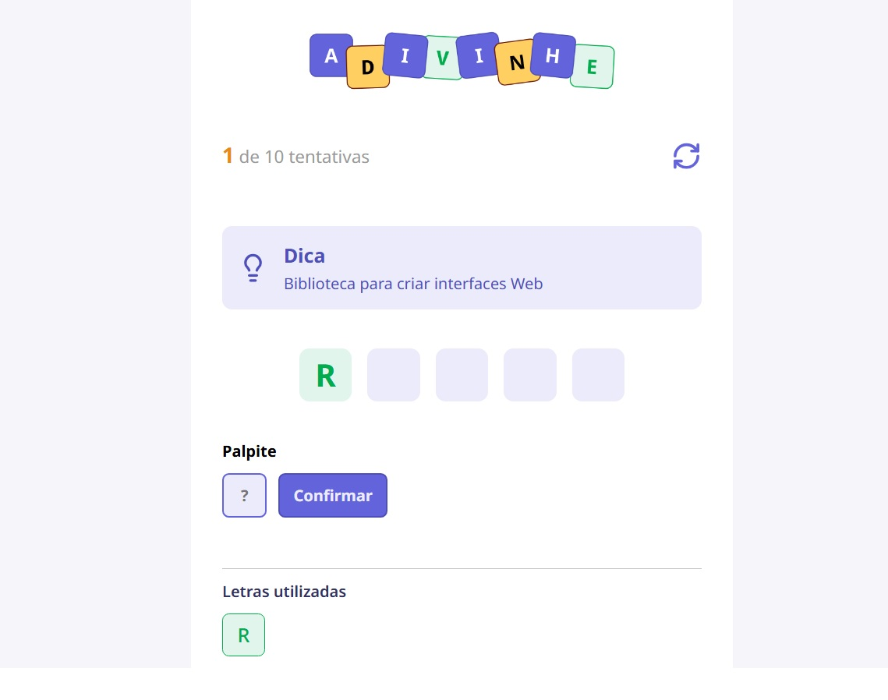

# 🎯 Word Guessing Game

Um jogo de **adivinhação de palavras** desenvolvido em **React**, onde o jogador deve descobrir a palavra correta digitando letras, com base em uma dica exibida na tela.

O projeto foi criado com foco em **lógica, controle de estado, fluxo da aplicação e boas práticas com hooks**, especialmente `useState` e `useEffect`.

---

## 🕹️ Como funciona o jogo

- Ao iniciar o jogo, uma **palavra aleatória** é escolhida junto com uma **dica**.
- O jogador digita **uma letra por vez** no campo de palpite.
- Após confirmar:
  - ✅ **Se a letra existir na palavra**, ela aparece na palavra oculta e fica marcada em **verde** nas letras utilizadas.
  - ❌ **Se a letra não existir**, ela não aparece na palavra e fica marcada em **laranja** nas letras utilizadas.
- Todas as letras digitadas ficam listadas na seção **Letras Utilizadas**.
- Letras corretas aparecem **na posição correta da palavra**.
- Letras repetidas não são aceitas.

---

## 🏁 Condições de vitória e derrota

- 🎉 **Vitória**:  
  O jogador vence quando descobre **todas as letras da palavra**.

- 😢 **Derrota**:  
  O jogo termina quando o número de tentativas atinge o limite:
  

- Ao final do jogo (vitória ou derrota), uma mensagem é exibida e o jogo reinicia automaticamente.

---

## 🧠 Lógica aplicada

- Controle de estado com:
- `score` (pontuação baseada nos acertos)
- `lettersUsed` (letras já utilizadas e se foram corretas)
- `challenge` (palavra e dica atual)
- Uso de:
- `useEffect` para:
  - iniciar o jogo
  - monitorar vitória ou derrota
- Manipulação de strings com:
  - `toUpperCase()`
  - `split()`
  - `filter()`
- Validação para impedir letras repetidas
- Feedback visual por cores (acerto e erro)

---

## 🎨 Interface

- Interface simples e intuitiva
- Cores diferentes para:
- letras corretas
- letras incorretas
- Layout baseado em um **design do Figma**
- Componentização para melhor organização do código

---

## 🚀 Tecnologias utilizadas

- React
- TypeScript
- CSS Modules
- Hooks (`useState`, `useEffect`)

---

## 📂 Estrutura do projeto

- Componentes reutilizáveis:
- Header
- Input
- Button
- Letter
- LettersUsed
- Tip
- Lógica central concentrada no `App.tsx`
- Palavras e dicas organizadas em um arquivo separado (`utils/words`)

---

## 📌 Objetivo do projeto

Este projeto foi desenvolvido como parte do processo de aprendizado em **Front-end**, com foco em:

- Entendimento de fluxo de aplicação
- Raciocínio lógico
- Organização de estado
- Prática real com React

---

## 👨‍💻 Autor

Implementação e lógica desenvolvidas por **Anderson Passos**, com foco em React, TypeScript e controle de estado. 
